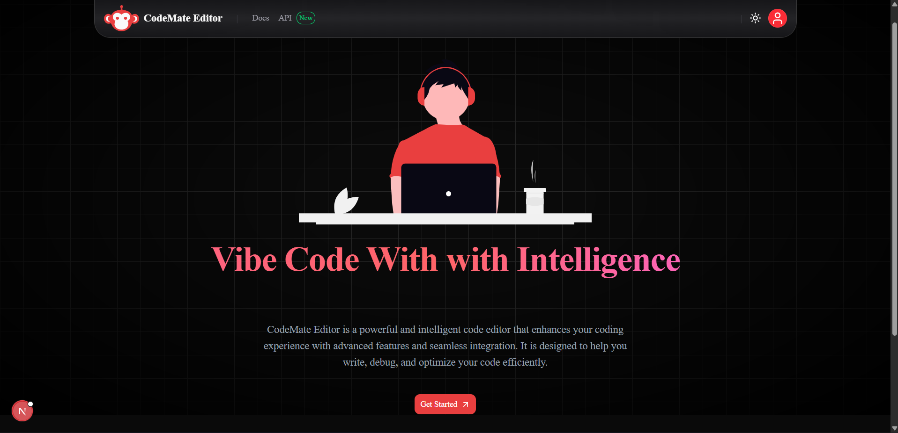
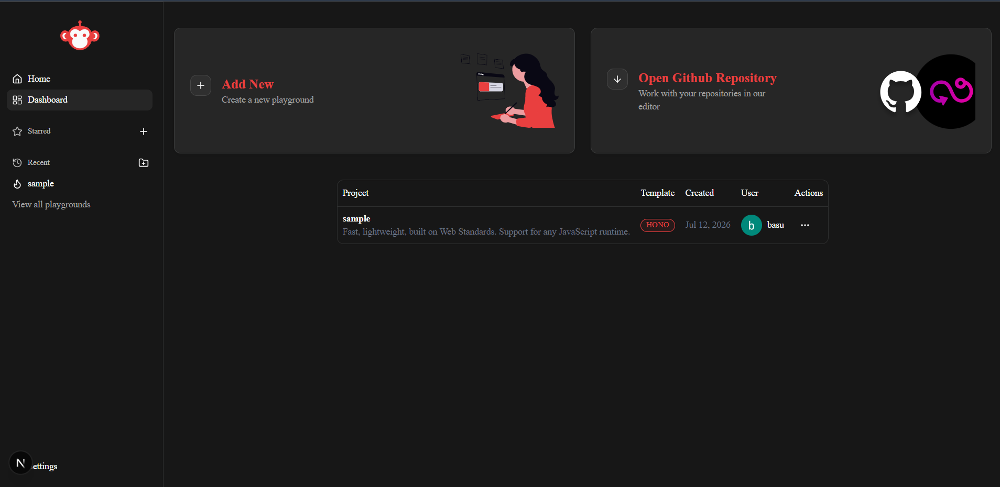
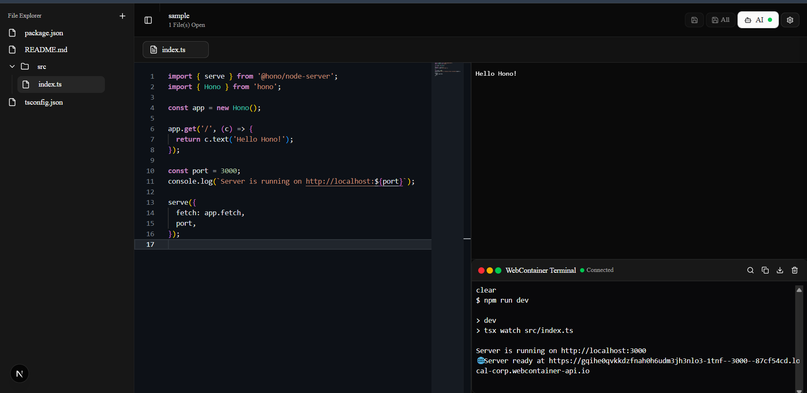
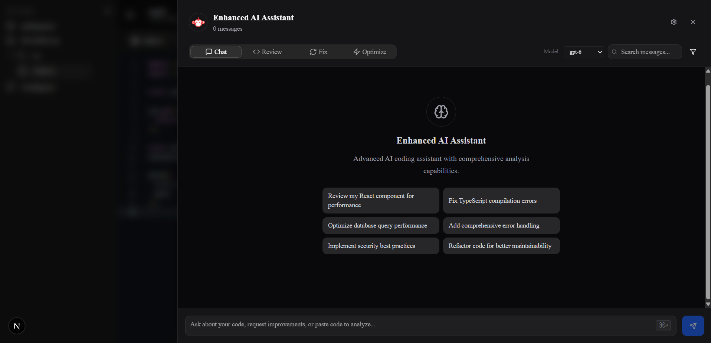

# 🚀 CodeMate – AI Powered Browser IDE

<p align="center">
  <h3 align="center">
    A modern AI-powered browser IDE built with Next.js, Monaco Editor, WebContainers, and Ollama.
  </h3>

  <p align="center">
    Create projects, write code, run applications, and interact with AI—all directly in your browser.
  </p>
</p>

---

# 📸 Preview

## 🏠 Landing Page



---

## 📊 Dashboard

Manage your coding playgrounds, organize projects, and quickly access recent work.



---

## 💻 AI Powered Code Editor

A complete development environment featuring Monaco Editor, browser terminal, live preview, AI-powered code suggestions, and an integrated file explorer.



---

## 🤖 AI Chat Assistant

Review code, optimize performance, fix bugs, explain code, and chat with local AI models powered by Ollama.


---

# ✨ Features

## 🔐 Authentication

- Google Authentication
- GitHub Authentication
- Secure authentication with NextAuth.js

---

## 📁 Project Management

- Create Projects
- Duplicate Projects
- Delete Projects
- Edit Project Information
- Favorite Projects
- Recent Projects
- Multiple Project Templates

---

## 🗂 File Explorer

- Create Files
- Create Folders
- Rename Files
- Delete Files
- Organized Project Structure

---

## 🖊 Monaco Editor

- Syntax Highlighting
- Auto Formatting
- Multi-language Support
- Keyboard Shortcuts
- Fast Editing Experience

---

## 🤖 AI Assistant

- AI Code Completion
- AI Chat Assistant
- Code Review
- Bug Fix Suggestions
- Code Optimization
- Context Aware Responses

Powered locally using **Ollama**.

Supported Models:

- CodeLlama
- GPT-OSS
- Any Ollama Compatible Model

---

## ⚙ Browser Runtime

Powered by **WebContainers**

- Run React Apps
- Run Next.js Apps
- Run Express Apps
- Run Hono Apps
- Execute Projects Entirely Inside Browser

---

## 💻 Integrated Terminal

Built using **xterm.js**

- Interactive Terminal
- Command Execution
- Live Logs
- Browser-based Runtime

---

## 🎨 Modern UI

- Tailwind CSS
- ShadCN UI
- Dark Theme
- Light Theme
- Responsive Design

---

## 🔔 Better User Experience

- Toast Notifications
- Loading States
- Tooltips
- Smooth Animations

---

# 🛠 Tech Stack

| Category | Technology |
|-----------|------------|
| Framework | Next.js 15 |
| Language | TypeScript |
| Styling | Tailwind CSS |
| UI Library | ShadCN UI |
| Authentication | NextAuth.js |
| Database | MongoDB Atlas |
| ORM | Prisma |
| Code Editor | Monaco Editor |
| AI | Ollama |
| Browser Runtime | WebContainers |
| Terminal | xterm.js |
| State Management | Zustand |

---

# 🚀 Getting Started

## Clone Repository

```bash
git clone https://github.com/vishesh694/codemate.git

cd codemate
```

---

## Install Dependencies

```bash
npm install
```

---

## Configure Environment Variables

Create a `.env.local`

```env
AUTH_SECRET=

AUTH_GOOGLE_ID=
AUTH_GOOGLE_SECRET=

AUTH_GITHUB_ID=
AUTH_GITHUB_SECRET=

DATABASE_URL=

NEXTAUTH_URL=http://localhost:3000
```

---

## Generate Prisma Client

```bash
npx prisma generate
```

---

## Push Database Schema

```bash
npx prisma db push
```

---

## Start Ollama

Example:

```bash
ollama run codellama
```

or

```bash
ollama run gpt-oss
```

You can also use any Ollama-supported coding model.

---

## Start Development Server

```bash
npm run dev
```

Visit

```
http://localhost:3000
```

---

# ⌨ Keyboard Shortcuts

| Shortcut | Action |
|----------|--------|
| Ctrl + Space | Trigger AI Code Suggestion |
| Double Enter | Trigger AI Suggestion |
| Tab | Accept AI Suggestion |

---

# 📂 Project Structure

```
.
├── app/
├── components/
├── hooks/
├── lib/
├── modules/
├── prisma/
├── public/
├── types/
├── utils/
├── middleware.ts
├── auth.ts
└── package.json
```

---

# ✅ Completed Features

- ✅ Google Authentication
- ✅ GitHub Authentication
- ✅ Dashboard
- ✅ Project Management
- ✅ Favorite Projects
- ✅ Recent Projects
- ✅ Multiple Templates
- ✅ Monaco Editor
- ✅ Browser Terminal
- ✅ WebContainers
- ✅ AI Code Suggestions
- ✅ AI Chat Assistant
- ✅ File Explorer
- ✅ Live Preview
- ✅ Toast Notifications
- ✅ Responsive UI
- ✅ Dark Mode

---

# 🚧 Future Improvements

- Git Integration
- Live Collaboration
- Deployment Support
- AI Debugging Assistant
- AI Refactoring
- Multi-file AI Context
- Project Sharing
- Version History
- Real-time Collaboration

---

# 💡 Why CodeMate?

CodeMate combines a powerful browser-based development environment with local AI models through Ollama.

Instead of switching between multiple tools, developers can:

- Build applications
- Manage projects
- Edit code
- Run applications
- Use AI assistance
- Execute terminal commands

—all from a single modern web application.

---

# 🤝 Contributing

Contributions are welcome!

1. Fork the repository
2. Create a feature branch

```bash
git checkout -b feature/new-feature
```

3. Commit your changes

```bash
git commit -m "feat: add amazing feature"
```

4. Push your branch

```bash
git push origin feature/new-feature
```

5. Open a Pull Request

---

# 📄 License

Licensed under the MIT License.

---

# 🙌 Acknowledgements

Built using

- Next.js
- React
- TypeScript
- Prisma
- MongoDB Atlas
- NextAuth.js
- Monaco Editor
- WebContainers
- Ollama
- xterm.js
- Tailwind CSS
- ShadCN UI

---

## ⭐ If you like this project, please consider giving it a Star.

Made with ❤️ by **Vishesh Bansal**